# 🤖 Client Workflow Automation Suite (Client-Auto-Suite)

## 📌 Project Overview

This project implements an intelligent workflow automation system using **n8n**, **Gotenberg**, and **Ollama (AI)** to process incoming client emails.

The system automatically cleans email content, uses **Local AI (Llama 3.2)** to generate concise and organized filenames, converts the email body to PDF, and archives everything (PDF + original attachments) into a **dynamically selected Microsoft OneDrive folder**.

---

## 🚀 Features

* **📧 Email Trigger:** Initiates instantly upon receiving emails via Gmail API.
* **🧠 AI-Powered Renaming:** Uses a local Large Language Model (Ollama/Llama 3.2) to analyze email content and generate smart, readable filenames (e.g., `Invoice_Vodafone_Oct.pdf`).
* **🧠 Smart Context & Fuzzy Matching:**
  * **ID Extraction:** Automatically extracts Project IDs from email subjects (e.g., `357 - Project X`) to locate the correct root folder.
  * **Typo Correction:** Uses the **Levenshtein Distance algorithm** (Fuzzy Matching) to route files to the correct Entity folder, automatically correcting human errors (e.g., routing "Microft" → "Microsoft").
* **📄 PDF Conversion:** High-fidelity conversion of HTML emails to PDF using Gotenberg.
* **☁️ Unified Archiving:** Uploads both the generated PDF and original attachments to the correct OneDrive destination.

---

## 🛠️ Prerequisites

* **Docker** and **Docker Compose** installed.
* **Google Cloud Console** credentials (Gmail API enabled).
* **Azure Portal** credentials (OneDrive/Graph API access).
* *Recommended:* At least 8GB RAM (to run the AI model smoothly).

---

## 💻 Installation & Setup

### 1. Clone the Repository

```bash
git clone https://github.com/your-username/n8n-client-automation-suite.git
cd n8n-client-automation-suite
```

### 2. Configure Environment Variables (.env)

Create a file named `.env` in the root directory of the project (alongside `docker-compose.yml`). Copy and paste the following content, then replace the placeholder values with your actual credentials:

```ini
# ==========================================
# N8N SYSTEM CONFIGURATION
# ==========================================
N8N_HOST=localhost
N8N_PORT=5678
N8N_PROTOCOL=http
NODE_ENV=production

# SECURITY: Replace this with a long random string (e.g., generate one in a password manager)
# If you lose this key, you lose access to stored credentials in n8n.
N8N_ENCRYPTION_KEY=change_this_to_a_random_secure_string

# Internal Data Path (Do not change unless you know what you are doing)
N8N_USER_FOLDER=/home/node/.n8n

# ==========================================
# CREDENTIALS INJECTION
# These values are passed directly to the n8n container
# ==========================================

# --- Microsoft Azure (OneDrive) ---
# Obtain these from Azure Portal > App Registrations
AZURE_CLIENT_ID=your_azure_client_id_here
AZURE_CLIENT_SECRET=your_azure_client_secret_here
AZURE_TENANT_ID=your_azure_tenant_id_here

# --- Google (Gmail) ---
# Obtain these from Google Cloud Console > APIs & Services
GOOGLE_CLIENT_ID=your_google_client_id_here
GOOGLE_CLIENT_SECRET=your_google_client_secret_here
```

### 3. Start the Services (Docker)

Run the following command to build and start the containers (n8n, Gotenberg, and Ollama):

```bash
docker-compose up -d
```

### 4. Install the AI Brain (Crucial Step) 🧠

The AI container starts empty by default. You must download the Llama 3.2 model manually for the first time. Run this command in your terminal:

```bash
docker exec -it ollama ollama run llama3.2
```

> **Note:** Wait until the download finishes (approx. 2GB). When you see a prompt like `>>>`, type `/bye` to exit.

---

## ⚙️ n8n Workflow Configuration

### 1. Access n8n UI

Open your browser and navigate to: `http://localhost:5678`

### 2. Import the Workflow

1. Click the **"Add Workflow"** menu (top right).
2. Select **"Import from..."** → **"From File"**.
3. Upload the `workflow.json` file provided in this repository.

### 3. Connect Credentials

You will notice some nodes with red warning signs. You need to authenticate them using the credentials created in Step 2:

| Node | Action |
|:-----|:-------|
| **Gmail Trigger / Get Message** | Select "Create New Credential" → OAuth2 → Use your Google Cloud credentials. |
| **Ollama Model** | Set the Base URL to `http://ollama:11434` (No auth required). |
| **OneDrive Nodes** | Select "Create New Credential" → OAuth2 → Use your Azure credentials. |

### 4. ⚠️ Usage Convention (IMPORTANT)

This workflow is designed to process standardized emails. Ensure incoming emails follow this **Subject Line format:**

| Format | Example |
|:-------|:--------|
| `ID - Project Name` | `357 - Portas da Madeira` |

> **How it works:** The system automatically extracts the ID (e.g., `357`) and uses the **Microsoft Graph API** to locate the corresponding project root folder in OneDrive. No manual node configuration is required.

---

## 🏃 Usage

1. **Activate the Workflow:** Toggle the switch to "Active" (top right corner of n8n).
2. **Send an Email:** Forward a client email with attachments to your connected Gmail address.
3. **Monitor:** Go to the "Executions" tab in n8n to watch the process in real-time.
4. **Result:** Check your OneDrive folder. You will see:
   * The original attachments.
   * A new PDF generated from the email body, automatically renamed by AI (e.g., `Invoice_ClientName_Date.pdf`).

---

## 🏗️ Architecture

| Service | Role |
|:--------|:-----|
| **n8n** | The orchestrator that manages the logic and API connections. |
| **Gotenberg** | A stateless API for converting HTML/Markdown to PDF. |
| **Ollama** | Runs the Large Language Model (Llama 3.2) locally for privacy-focused text analysis. |
| **Docker** | Encapsulates the entire environment for easy deployment. |

### Workflow Diagram

```mermaid
graph TD
    A["📩 Client Email"] -->|Gmail API| B(n8n Webhook)
    B --> C{"🔍 Extract Data"}
    C -->|"Subject: 357 - Project"| D["🆔 Get Project ID"]
    C -->|Body HTML| E["📄 Gotenberg PDF"]
    C -->|AI Analysis| F["🤖 Ollama / Llama3"]
    
    F -->|Clean Filename| G[Rename Files]
    
    subgraph "Smart Routing Logic"
    D --> H[List Entities in OneDrive]
    H --> I{"Fuzzy Match Algorithm"}
    I -->|"Match > 75%"| J[Select Existing Folder]
    I -->|No Match| K[Create New Folder]
    end
    
    G --> L["📤 Upload PDF + Attachments"]
    J --> L
    L --> M["☁️ Microsoft OneDrive"]
```



---


